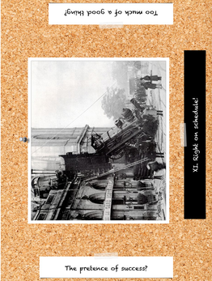

# Creating Characters

All good things start with stories. It's not just a buzzphrase, by the way.
If you are building a story, whether you are role-playing, storytelling for
an audience or writing a book, the story comes first and everything else
tends to follow naturally.

So let us start with, once again, a story.

Our story is set in a fantasy archipelago inhabited by dozens of sentient
species, and loosely inspired from Ancient Greece, with larger ships.
One by one, the islands have fallen to the powerful and evil Spartan
Legion, whose overlord now rules the archipelago nearly uncontested.

So far, these are a few sentences that most GMs could improv before coffee.
We'll see more about improvising campaigns and settings
[in the dedicated chapter](campaigns.md). For the moment, we're only
interested in major NPCs, so we'll let the story flow without much
detail and concentrate only in the introduction of these NPCs.

Our first player arrives. The GM tells him about the archipelago, the
Spartan Legion, the war.

- GM: "So, what kind of character would you like to play?"
- Player 1: "Mmmh... Well, obviously, a future hero. I don't know much
    about the setting yet. so let's start with someone who's not involved
    in the war at all. Maybe some kind of farmer's kid, eager for adventure.
    I'll call him Desmondos."

Facts established:
- **Desmondos doesn't know much about the war**
- **Desmondos grew up on a farm**
- **Desmondos is eager for adventure**

- GM: "Alright. This story is going to be about you, and the other PCs,
    taking an active part in the war against the Spartan Legion.
    Desmondos, can you tell me how you *enter this plot*?"
- Desmondos: "Could I receive a message accidentally? Some magical
    message that's meant for an enemy of the Spartan Legion, who
    hides on the same island as me, but for some reason, I got the
    message, and since I'm eager for adventure, I decide to bring
    it to the intended recipient?"
- GM: "That sound good. Player 3 told me that she wants to play
    some kind of princess. Let's say it's from her. It will create
    the first relationship between your characters. Once Player 3
    arrives, we'll see later how she gets drawn into that plot.
    I don't know how she wants to call her character, but let's
    say Erikaia. We'll change the names retroactively if she
    doesn't like it."
- Desmondos: "Yeah, I received a message from Princess Erikaia."
- GM: "Ok, now tell me more about this message."
- Desmondos: "Well, it seems to be encrypted somehow. But it's clearly meant
    for a general, an enemy of the Spartan Legion, who hides on this island."
- GM: "Sounds good. I'll need a name for this general."
- Desmondos: "General Gregorios, of the Free Company."

Facts established:
- **The Free Company fights the Spartan Legion**
- **General Gregorios, of the Free Company, hides on this island**

After a few adventures, Desmondos manages to locate General
Gregorios.

- GM: "So, tell me more about this General Gregorios."
- Desmondos: "He's in his fifties and he's some kind of Paladin. He's very strong, too."
- GM: "Ok. General Gregorios tells you a bit more about the Spartan Legion – basically
    what we had established during campaign creation. Also, it's lead by a general
    called... Drakon the Undefeated."
- Desmondos: "Oh, and can Gregorios take me as an apprentice? I want to become a Paladin like him!"
- GM: "Gregorios smiles at your requests and answers '*Well, you have certainly proven worthy. We can give it a try.*""

The GM ponders it a second, and decides that since Gregorios is clearly
much stronger than Desmondos – and all threats should be scaled for
Desmondos and his friends rather than for Gregorios – Gregorios doesn't
need a character sheet. If necessary, Gregorios may be used as a *bonus*
to make things possible or improve the results of Desmondos' actions.
Not creating the character sheet immediately means that the GM is free
to improvise the exact strength and powers of Gregorios as the story
evolves, and to tailor it to wherever the story leads.

Facts established:
- **General Gregorios is in his fifties.**
- **General Gregorios is some kind of Paladin.**
- **General Gregorios is much stronger than the heroes.**
- **General Gregorios is now the mentor of Desmondos.**
- **There's a General Drakon the Undefeated of the Spartan Legion.**

Once decyphered, the message tells of a terrible threat,
some kind of spell that will forever erase freewill from
the mind of all inhabitants of the archipelago. General
Gregorios is the last hope of the Free Company and the
archipelago. Gregorios and Desmondos decide that they
need a ship to reach the hidden camp of the Free Company,
to warn them of the terrible danger.

Facts established:
- **The Spartan Legion is about to unleash a terrible spell**

Oh, Player 2 has just arrived!

- Player 2: "Sorry about that, I hope you guys started without me!"
- GM: "We certainly did. Desmondos, do you wish to tell Player 2
    about what has happened so far?"
- Desmondos: [...]
- GM: "... and so, we arrive to the moment where the heroes are
    looking for a way to leave the island and reach the hidden
    camp of the Free Company. Does this give you ideas for a
    character?"
- Player 2: "Yeah. Could I be some kind of mercenary... no, say
    a smuggler? I have my own ship, it's small, it's fast, it
    can get around the islands quickly and unseen."
- GM: "That would certainly work. So, your plot introduction is
    that you're going to be hired to bring the other heroes to
    their destination, right?"
- Player 2: "Right. And they don't have money with them, so I'm
    going to stick with them until they pay me, because I have
    debts. Also, it's a good way for me to get out of the way,
    because someone might be after me to break my knees or
    something."
- GM: "Sounds good. Do you have a name?"
- Player 2: "Mmmmh... Frankos the Sailor."

Facts established:
- **Frankos the Sailor has a small and fast ship.**
- **Frankos the Sailor has debts.**
- **Frankos the Sailor has a contract with Gregorios and Desmondos.**

After more adventures, all three characters find themselves
hidden in the hold of Drakon the Undefeated's own ship.
Right on time, Player 3 arrives.

- Player 3: "Sorry guys, I told you I'd arrive a bit late. Did you
    keep me Princess Erikaka, as I asked?"
- GM: "Yes, we did. Player 1, Player 2, can you tell her about
    what has happened so far?"
- [...]
- Player 3, now Erikaia: "Ok, then it's simple. I'm prisoner in that ship!"
- GM: "Tell me more, why are you held prisoner?"
- Erikaia: "Well, I'm one of the leaders of the Anti-Spartan Legion..."
- Desmondos: "We decided to call it the Free Company."
- Erikaia: "Ok, I'm one of the leaders of the Free Company. Also, I got word
    from a terrible threat..."
- Desmondos: "Oh, we got that one, too. There's a freewill-wiping spell,
    and the Spartan Legion is going to launch it soon."
- Erikaia: "Er... right. So, the bad guy..."
- Desmondos: "... General Drakon the Undefeated!"
- Erikaia: "You're annoying. No, his boss, The Demagogue, ordered me arrested."
- GM: "Sure. You managed to somehow send a message to General Gregorios before
    being arrested, with details about that spell."

Facts established:
- **Erikaia is prisoner in Drakon's ship**
- **Erikaia is one of the leaders of the Free Company**
- **Drakon the Undefeated's boss is called The Demagogue**

Erikaia, Desmondos and Frankos manage to remain hidden but General Gregorios
isn't so lucky. He's somehow separated from the PCs, who can only witness
from afar as Drakon the Undefeated shows up.

- GM: "It's Drakon. You recognize him easily from the description given
    by Erikaia. He's strong, he wears a mask, and he seems to be the
    same kind of Paladin as General Gregorios."

Facts established:
- **Drakon the Undefeated wears a mask**
- **Drakon the Undefeated is also some kind of Paladin, like General Gregorios**

After a short battle, General Gregorios is mercilessly executed by Drakon
the Undefeated, while the heroes manage to escape the ship.

Facts established:
- **Drakon the Undefeated is über-badass**

Frankos the Sailor manages to bring Princess Erikaia
and Desmondos to the Free Company. Ensues a discussion on
battle tactics, led by Princess Erikaia and the leader
of the Free Company.

- GM: "One second, Erikaia. Tell me something about the leader of the Free Company."
- Erikaia: "She's called Myra Medea. Also, she's dressed in white."

Facts established:
- **Myra Medea is the leader of the Free Company**;
- **Myra Medea dresses in white**.

After debate, the conclusion is that the only way to save
the archipelago is to send several groups of the Free
Company – including the PCs – to board Drakon's ship,
carrying counterspells, hoping that one will be able
to apply one of these counterspells to the pentagram
that will be used to carry out the spell. Of course,
the attack must be launched immediately.

Big battle ensues. Drakon the Undefeated illustrates his strength
by killing dozens of unnamed NPCs (since Drakon the Undefeated
has been established to be so very powerful, the GM and players
conspire to tell how he always has something more important
to do than chasing the PCs). Eventually, once most friendly NPCs
are dead, Drakon the Undefeated decides to attack the PCs, but
an explosion throws him overboard.

The counterspell is launched, the spell is averted, everybody rejoices,
and Drakon swears revenge.

Congratulation, heroes!

As for you, reader, you may have realized a few things:
- the major NPCs of this story (Drakon, Gregorios, the Demagogue, Myra Medea)
    didn't need much in terms of character creation;
- with a few tricks, the GM managed to entirely avoid character sheets
    for these characters;
- most of the creation for the characters was actually done by the players,
    rather than the GM;
- you already know this story.

Oh, yes, did we forgot to mention it? We should thank our actors, who
    came specially from *Star Wars* Episode IV to take the exact same
    roles in this antique variants:
- Luke Skywalker (as Desmondos);
- Princess Leia (as Princess Erikaia);
- Obi-Wan Kenobi (as General Gregorios);
- Darth Vader (as Drakon the Undefeated);
- Han Solo (as Frankos the Sailor);
- Emperor Palpatine (as the Demagogue);
- Senator Mon Mothma (as Myra Medea);
- ...

## The Spartan Legion Strikes Back

The story is not over, of course. Eventually, Drakon the Undefeated will manage
to trick Princess Erikaia and Frankos the Sailor into a trap and lure Desmondos
the, er, Hoplite of Light into a hopeless fight.

As our example is a Role-Playing Game, this scene may now go two ways. Either it
can become a by-the-book round-by-round combat, or the GM and Players may come
up with something a bit more inventive. In fact, since Drakon is so much stronger
than Desmondos, a by-the-book combat scene would probably be rather boring, with
Desmondos' player rolling attack after attack, only for them to be deflected by
a Drakon who could certainly kill Desmondos in a single half-hearted blow.

So, let's be a little more inventive.

- GM: "I have bad news for you, Desmondos. Drakon is really, really, really much
    stronger than you. You don't stand a chance."
- Desmondos: "Er... right. Should I create a new character?"
- GM: "Not quite yet. We're going to tell together how you fail to beat Desmondos,
    but he won't kill you. Perhaps you'll be captured, as Erikaia and Frankos, or
    perhaps you'll manage to escape, I don't know yet, but let's face it, you have
    no way of actually beating Drakon."
- Desmondos: "Oh, right. Escaping or being captured, sure, that sounds good. Do
    I get to pick now?"
- GM: "Well, you can, if you – as a player – have a strong preference, but otherwise,
    we'll see as the scene progresses."
- Desmondos: "Sounds good. Should I roll for attacks?"
- GM: "Doesn't sound really useful, but you can describe your attacks, and how
    Drakon evades or deflects them. But in fact, this scene is more a conversation
    with the swordfighting as a bit of background noise, rather than a traditional
    fight scene."
- Desmondos: "I run at him, yelling « YOU WILL NEVER GET ME, DRAKON! » while I
    attempt to stab him with my spear, but he deflects it effortlessly."
- GM as Drakon: "Oh, but I will, young Hoplite. My master, the Demagogue, has
    foreseen it."
- ...

As usual, it would be surprising if this exact dialog took place during a Storytelling
performance or a Writing session, but the reasoning applies just as well to either case.

- Desmondos: "As I drop my spear and try to go under his shield with my dagger,
    « I know that you killed my father ! », but he manages be able to catch
    my wrist and force me to drop the dagger."
- GM as Drakon: "Who told you that?"
- Desmondos: "Could Gregorios have told me that?"
- GM, taking notes: "Sure."
- Desmondos: "Gregorios told me, before you murdered him, like the coward you are!"
- GM as Drakon, with a smirk: "That old fool lied to you, Desmondos. I AM YOUR FATHER."

Facts established so far:
- **Gregorios claims that Drakon killed Desmondos' father**
- **Drakon claims that he's Desmondos' father**
- **Drakon claims that the Demagogue has somehow foreseen the capture of Desmondos**

- GM: "It's time to end the scene, by the way. Are you going to be captured, injured,
    are you going to escape?"
- Desmondos: "I think he actually broke my wrist. Let me draw a card to find out how
    I manage to escape."

- Desmondos: "We were fighting close to this gaping hole, right? **Being ready, always**,
    can I have had time to look at the bottom of the hole and realize it communicates
    with the sea?"
- GM: "Yep."
- Desmondos: "Then I take one step backwards and drop into the hole. The fall will
    certainly hurt me, but I hope that my friends can rescue me in their ship."
- GM: "Very well. When he realizes what you're trying to do, Drakon the Undefeated
    attemps to grab you, but he's just one tiny instant too late, and by then, you
    are already falling down. Falling down is the last thing you remember. You'll
    lose consciousness when hitting the water."

What we have done here is subverting the round-based combat (hero acts, bad guys
act, hero acts, bad guys act, ...) dear to many role-playing games, in particular
video games, but also to many action movies and rephrasing this encounter as a conversation
between Desmondos and Drakon. For one thing, the combat would have made no sense,
as Drakon is so much more powerful than Desmondos. In a role-playing game, a combat
scene would have been both frustrating and limiting. Regardless of storytelling
format, making it a conversation made it interesting: the characters exchanged both
threats and informations, moving the plot forwards. While we do not know, at this
stage, whether Drakon is telling the truth, he undoubtedly had a good reason for
his claims. Investigating the relationship between Drakon and Desmondos sounds like
a very nice hook for the next part of the story.

And, once again, letting the player (or, in other formats, the audience) decide
the rhythm of the fight and the mean of escape of Desmondos both avoid the frustration
of this one-sided fight and setup the means of regaining hope in the rest of the story.

Oh, and in a role-playing format, it also means that we still don't need a detailed
character sheet for Drakon the Undefeated.

We'll stop the story of Archipelago Wars here, on this apparent defeat of the heroes,
and we leave it as an exercise for the reader to determine just exactly how much
needs to be prepped ahead of time about the characters of this story for Episode VI,
*Return of the Hoplite of Light*. Hint: we can get away with the answer "nothing".

If you have time to create detailed backstories and/or character sheets ahead of
time, and if you enjoy this task, you are of course welcome to do so. Just be
aware that it is not a requirement.

# Step-by-step character creation

Depending on your story, characters may reach much further than
human (or human-like) beings. A conspiracy may be a character,
a religion may be a character, a malicious or soothing mountain
or sea or the immensity of space may be characters, Tolkien's One Ring
may be a character, etc. Let's settle for the following rule:

> A *character* is anything that can, somehow, be attributed a
> role in the story, a face, a purpose, an attitude and means.

Of course, "role", "face", "purpose", "attitude" and "means"
will mean very different things for the brutish Orc Warchief,
the inscrutable depths of the sea or the gender-swapped alter
ego of the hero. The Warchief is commonly a villain, or could
be a mentor, distant father or worshipped leader. The sea
may be oppressing or soothing, mysterious or bountiful,
a terrain of adventure, or the last place where the dregs of
mankind take refuge when everywhere else is barred to them.
The gender-swapped alter ego could be competition or comic
relief, love interest or the only person with whom the hero
can share a beer and discuss freely politics or today's
supervillain.

If you have read the previous chapters, role, face, purpose,
attitude and means may sound to you like a list of Questions.
Well, if it sounds like Questions, let's treat it as Questions.

As usual, you may find your Answer in established Facts, or
in discussion with your audience/players/fellow players or
in a coffee cup, or in a movie you have just seen, or in
a conversation you have overheard in the subway, or
pretty much anywhere else. For the rest of this section,
we'll assume that we haven't found all our Answers yet,
and we'll typically use the Space·Time Deck.

## Character fit

*Initially, how does this character fit in the story?*

In most cases, you already know the answer:
- the Main Villain, who intends to rob the city blind;
- the smithy, who repairs the heroe's armors;
- the witness of the murder, who needs to be interrogated;
- a shady character of vague villainess, who may be reused later in any purpose;
- the hero;
- a possible rival;
- a possible love interest;
- an obstacle;
- the owner of the house the heroes are robbing, and who might
    wake up at any second now;
- ...

If you don't know the answer, in some cases, it might be a
sign that you don't need to create that character yet – a
character with no role is one who has pretty strong chances
of never showing up in the course of the story. Then again, you
may have a very good reason to create that character,
so let's look at a few examples.

### Example: The hero

This is a story of pirates. A new player wants to create a character
but has no idea what they want to play yet. *How does my character
fit in this story?*

A simple answer would be: "Just a random pirate." Let's
see if the Space·Time Deck can help us come up with
something more interesting.

A young woman in a white, possibly bridal, dress, with the
inspiration "Faithfulness unto death"...

- Player: "Can I play a young woman in this game? I mean, I know
    it's a pirate game, but I'd rather not play someone who's
    going to spend the entire story getting raped."
- GM: "I'm sure we can agree on that. A game about rape doesn't
    sound like much fun, so we'll establish this as a Fact
    before starting. Now, according to my Hollywood-acquired
    knowledge pirates, a young woman among
    bucaneers may have difficulties getting taken seriously.
    We may decide to simply ignore this trope, or to assume
    that your character is particularly good at either charisma
    or authority. I can work with either, which one would you
    prefer?"
- Player: "I'll go for the trope of the woman in a man's world,
    who swears twice louder than a man and fights twice harder,
    earning grudging respect."
- GM: "Sounds good. So, how do you fit in the story?"
- Player: "I think I'll be a bride-to-be, shipped from the Old
    World to be married to a bridegroom she has never seen, and
    who dreams to escape that fate. Can we introduce me to the
    plot when pirates board the ship on which I'm a passenger,
    I grab a sword, and defend myself so well that they offer
    me to become one of them?"
- GM: "What do you think if, say, you managed to disarm the pirate
    captain or take him hostage?"
- Player: "Sounds like he might wish to take revenge at some point,
    right?"
- GM, smirking: "Sounds exactly right."

With this conversation, the character has acquired not only a *role*,
but also an *attitude*. So far, so good.

### Example: The NPC

Context: The heroes are the staff of a Hollywood starlet, and
she's just as obnoxious as everything you can imagine. That's
an attitude. But *How does she fit in this story?*

Simple answers would be: annoying quest giver, or perhaps
comic relief. Let's ask the Space·Time Deck for an
alternative.

Taking flight? Sadly, it's just imagination? It sounds like
a tragic figure. It sounds like she's on her way towards
disillusion. So, what about making the starlet someone
who will need to be protected despite herself from the
shredder of hopes that is Hollywood?

If this is a role-playing game, this will, of course,
require buy-in from the players. If they do not enjoy
this direction, an alternative would be simply to let
the starlet crash and burn as a background to the main
event.

### Example: The mountain

Context: The heroes are the survivors of a plane crash on the Himalaya.
To make things worse, they are pursued by a local smuggler queen
and her thugs, for a reason they do not understand yet. On the
Himalaya, the mountain simply must have a role. *How does the
mountain fit in this story?*

A simple answer would be: a survivalist dream/nightmare. Let's
ask the Space·Time Deck for an alternative.

The Big Crunch, end of all things, interpreted as Longevity.
Despite the blackness, this actually sounds like a message of
hope. This Storyteller decides that the mountain, despite its
dangers, despite the fact that it may eventually swallow both
the hunted and the hunters, is a place of immensity and peace.
Rather than making the mountain smoething that needs to be
tamed or survived, the Storyteller concludes that it will be
more of a nurturing, hiding place, full of refuges and
breathtaking vistas that lead one towards contemplation rather
than violence.

Again, it not being realistic doesn't really matter. This is
just a story, and realism is part of another story.

Who knows, there may even be some magic involved.

### Example: The villain

Context: Musketeers, high ladies, Versailles, the court of the Sun
King Louis XIV, high intrigue and swashbuckling! The heroes have
heard a few times about Rochefort, a nobleman that they obviously
did not want to cross. Unfortunately, Rochefort has now heard about
them. It is time for Rochefort to properly enter the story.
*How does he fit in this story?*

A simple answer would be: the big bad villain. Let's ask
the Space·Time Deck for an alternative.

Under-equipped? A doctor in a plague mask? It could be that
Rochefort has evil objectives, but right now, it looks like
he needs help. Also, perhaps he is sick himself. So Rochefort,
evil and ailing Rochefort, needs reinforcements. Whatever he has heard
about the heroes, he thinks of them as possible henchmen.

### Example: The faction/conspiracy

Context: Space Opera, large empires torn by war or tied by
fragile alliances. In several occasions, the heroes have found
traces of the mysterious House of Eyes, as a power that may
be involved in the ongoing attempts on the ambassadors of
the Blue Alliance. *How does the House of Eyes fit in the story?*

A simple answer would be: a powerful conspiracy to prevent peace
and/or to ensure victory of some faction. Let's ask the Space·Time
Deck for an alternative.

A trainwreck labelled "The pretense of success", along with
watcherbys? Could it be that the House of Eyes is, rather than a
powerful conspiracy, the effort of a weak faction attempting to
gain real power by pretending to be the illusory power derailing
the Blue Alliance?

Let's go further: while the ambassadors of the Blue Alliance are
being dispatched, the House of Eyes has actually nothing to do
with it. The real culprits are agents of the Red Alliance, doing
their usual job. The House of Eyes is actually a single person,
an adventurer, without any real power to harm – yet. That person's
sole role in the attempts so far has been to somehow let it be
known that the House of Eyes was involved. The real plot of the
adventurer is to gain fame under his alias of the House of Eyes,
in to later turn this fame into power and money.

### Example: The Reluctant Hero

TBD

## A face

The face of a human being has little in common, of course,
with what will pass for a face in an Imagination Sprite
of the 15th Level, in a Computer Virus, or in the Labyrinth
of Souls. But they all have something visible, something by
which the heroes will see them – or guess at their presence.

*What does the character look like?*

Again, in many cases, you may already know the answer, or
have one at hand. If you don't, let's see a few examples.

### Example: The Virus

Context: Cyberpunk. A Virus has been unleashed in the Cyberspace
of Night City. The heroes have heard of it, now, it's time for
them to interact with it. *What does interacting with the Virus mean?*

![assets/card_6.png][assets/small_card_6.png]

A truth, hiden? Where is Waldo? The effects of the Virus
are hard to discern, at first. If the heroes are looking
for the Virus, they will find clues, but no single entity.
In fact, the Virus is probably not a single monolithic
program, but rather an emergent behavior of thousands
of smaller services and devices that interact with each
other in apparently harmess fashion.

Discussing with the Virus will mean receiving messages
from dozens of sources that form a single sentence.
Fighting the virus will mean being attacked by toasters
and cars and being swatted.

### Example: The hero

Context: Heroic Fantasy. The hero is a young soldier,
who has just been drafted in a generic fantasy group
of heroes sent to fetch the Holy Sword of the Veil,
the only artifact that can bring down the evil Black
Dragon. Yep, can't go much more generic. Now, *what does the character look and sound like?*

Well, wherever the hero got his equipment from, he
clearly looks ill-equipped, quite possibly disguised.
In other words, from the point of view of other
characters, he looks like a clown.

This answers the first part of our question. Let's draw
a second card: *what does the character sounds like?*

![assets/reversed_card_19.png][assets/small_reversed_card_19.png]

Apparently, our hero sounds like a drunk. Maybe he's
actually alcoholic, or maybe it's just the way he speaks.
Regardless, he seems to speak with drunk-logics that makes
it a bit hard on others to understand – or trust – him.
Also, whenever he's exchanging with someone, conversations
tend to veer towards drink, food, sleep, or any of the
other various pleasures of the flesh.

We're much less generic now, aren't we?

### Example: The villain

Context: Anthropomorphic animals in a post-apocalyptic world.
The villain controls the distribution of water in this
junkyard city. *What does that villain look and sound like?*

![assets/reversed_card_17.png][assets/small_reversed_card_17.png]

From the many soldiers on this card, let's deduce that the villain is not one
but many. The villain is actually an entire intelligent hive
of wasps, somehow gathered into a face looking like that of
a human being. It consequently speaks with buzzes, with a
dozen discordant frequencies.

Also, given the "Being ready, always", this villain certainly
expresses paranoia with every act and word.

## A purpose

In real life, many people don't really want something. At
least, they don't want it strongly enough that their every
action reflects this want. In stories, though, if your
characters don't want something, they are not contributing.
This may be sufficient for the first encounter with the
local smithy, but some day, you may wish to add depth to
this character. Similarly, a villain without a purpose
is useless. Even in quest-based stories, a quest-giver
without a purpose is nothing more than a classified ad
given a face.

Note that purposes may range from the intimate to the
cosmic. A religious smithy may be after absolution for
a petty thought, or might be trying to earn sufficient
money to pay for prayers for the birth of his first child.
Another one may be demotivated, waiting for his son to
grow old enough to take his place, or be after support
to become mayor of the city or guild spokesman. He can
just as well be waiting for the perfect victim whose
blood will be used to forge a Demonsword, or be plotting
the murder of an family whose sole fault is to be born
with a different skin color, or be busy preparing his
own equipment to join the Steel Crusade once it lands
on this planet. Or, he can be bidding his time until
Sunday, because that's when cousin Philip will come
from the city and they're going to have a great time
at the fair!

Outside of video games, it is unlikely that a character
will expose her purposes to a random stranger. As in the
real world, most characters are generally not even aware
of where they put their energy. But once a character has
a purpose, it will inform their choices and actions. The
religious smithy may, without realizing, be kissing his
holy book or nodding at the local idol whenever he passes
in front of it. The demotivated one will deliver late,
make mistakes and maybe look for arguments with the heroes.

As previously, in many cases, you may already know the answer, or
have one at hand. If you don't, let's see a few examples.

### Example: The Villain

### Example: The Quest-Giver

## Means

TBD

## And more

TBD

There is, of course, no rule written in stone that forbids
you from stopping there. If you wish to add depth to a
character, or if one of the Questions above didn't make
sense in your context, feel free to add more Questions.

Here are a few more examples:

- *What is the character hiding from others?*
- *What doesn't the character know about themselve?*
- *What is the destiny of the character?*
- *What is the character doing here?*
- *What troubles the character?*
- *Where does the character come from?*
- *What does the character hate?*
- *What does the character love?*
- *What is this character's weak point?*
- *What is this character's strong point?*
- *What is the relationship between character X and character Y?*
- ...

## Other tricks

- Reusing a character.
- The three-cards spread.

TBD

## Evil empires, conspiracies and other organizations as NPCs

TBD

---

So, your characters are about to meet that Ambassador of the
Qfew'dhi Confederation, and you have no clue what a Qfew'dhi
even means. Or they are going to be introduced to Temporary
People's Representative of the Floating Commune, and you have
no clue what that role entails. Or they are simply hitting
the library, or the local temple, or the tavern, for the fifth
time this session, for more details about that Screaming Demon,
and you'd like them to actually meet someone interesting. Or
maybe they have followed that kid pickpocket and stumbled upon
the Orphanage, and you have no clue what that Orphanage is,
but there must be some kind of Orphanage Ringmaster in it.

Or maybe you are a Player and the GM has just asked you to
tell her more about your cousin Janice, the one you infected
with that Psy-Virus during the first hours of Event 0. Or
you decided to summon a Familiar from the 15th Dimension,
and you just realized that you're going to need to give
it a few personality traits and, who knows, maybe even a
description!

Or maybe you're in the middle of a storytelling session,
and Sheherazade has decided to nest yet another story
inside a story, and she needs a new antagonist.

Life is hard, isn't it? But that's also what makes it fun.

Let's see how we can make it easier, while keeping the fun in.

## Nemeses and other Major NPCs

For this section, imagine the following setting.

------------------------

**FIXME** Could we find a good story support for creating two good
NPCs (one friendly, one baddy), piece-wise?

## Minor NPCs

We'll call a minor NPC a secondary character with whom you're
presumably only ever going to have simple interactions. That
guy from the forge, who's busy repairing your equipment and
might be bothered to barter with you for a moment. That woman
from the library, who has been helpful so far, but might
eventually grow fed up with your questions on non-Euclidian
tentacle-spaces. The constable who was first responder at
the crime scene and may, or may not have found anything
interesting.

One thing to remember before you actually start creating a NPC is
that, maybe, you might actually *not need to create it at all*.
As for everything else in a story, chances are that your players
(or audience, or readers) might not really care about that
elusive appearance of a random person in the street.

As is always the case, creation of a NPC starts by asking
meaningful questions. Let's start with the following
questions:

1. Do I actually need to create that NPC?
2. Would it be interesting to reuse a NPC that the heroes have already met?

By all means, don't forget this second question. The pub drunkard
is probably entirely uninteresting, and seeing a smithy is a
common occurrence in the village. However, realizing that the
smithy is yesterday's drunkard and still smells of boose
suddenly adds spice to the forge – and paves the way for
an accident that the heroes are going to witness.

Similarly, if the constable turns out to also be yesterday's friendly
woman from the library, this one-character-counts-double becomes much
more remarkable than each of its components. The players or readers
will now expect something more from this library/constable, which
means that you, as a GM or Storyteller, have a base upon which to
build.

Or, of course, this dead body might turn out to be yesterday's
drunkard, this morning's smithy, this afternoon's helpful woman in
the library, or the sister of this evening's constable. Again,
with such reuse, you have a base upon which to build.

3. What do I want the NPC to be?

For a minor NPC, chances are that you already know the answer:
- the smithy;
- the librarian;
- the constable;
- the tavern's drunkard;
- ...

In some cases, the level of detail you have in mind might not be sufficient:
- the person sitting next to you in the subway;
- the previous client of the shop;
- the sleeping owner of the house the characters picked randomly for robbing;
- ...

Let's pick that last one as an example and see if the Space·Time Deck can help: *Who owns this house?*

The "defenseless" part goes along with the idea that the owner is sleeping,
which doesn't help us much. With "Playing protector", on the other hand, wouldn't it be fun if
the owner was someone with close ties to the police? If the characters picked
a rich house, it could be the Empire's High Judge. Or, if it was a poorer house,
Constable Bob (retired).

We now know who we want the NPC to be. If you have just established an identity,
as above, you probably want to officially establish it as a Fact. It will come
useful very soon:
- **Owner: Constable Bob (retired).**

----

FIXME:
- What do I want the NPC to be?
- Where is the NPC right now?
- What is the NPC doing right now?
- What does the NPC look like?
- What does the NPC sound like?
- What does the NPC want?
- What does the NPC want to avoid?
- What does the NPC hide?

## About random tables

TBD

## Dealing with inconsistencies

TBD

An inconsistency *is* a question.

## What have we done and seen?

TBD

## Exercise time

1. Pick a movie of book of your choice.
2. Pick one of the major support characters, good, bad or other.
3. Determine what is the actual amount of Facts established on that character, and when that information is given.
4. Pick an instant when a Fact is established on that character. Find out what Question it answers.
5. Draw a card from the Space·Time Deck to answer that Question and come up with a different answer and set of Facts.
6. Try and see how this would affect the rest of the story.
