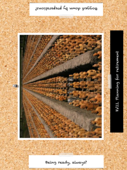
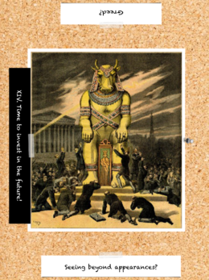
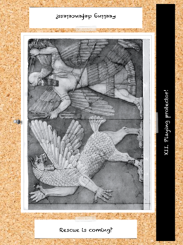

# Drawing for ideas

You know what? Let's keep explanations for later. Let's start with some action!

Imagine cars racing in the streets of Rio de Janeiro. It's the present. Two of the heroes (let's call them Desmond and Erika) share a sportscar, driving as fast as they can away from the HQ of Evil Corporation, where they just stole a USB key. Our third hero (Frank) is in the gadget van, driving more slowly, while looking at a map of traffic lights. A dozen of armed thugs on motorcycles are after Desmond and Erika. Also, imagine you have never visited Rio de Janeiro, you have no clue what the city looks like, and you haven't prepped this pursuit.

No problem. For one thing, we don't actually care what the city looks like – it's just a game, and you're not going to get it any more wrong than most Hollywood movies. So let's see what we can do to make it fun. If you *do* live in Rio de Janeiro, just imagine it's Istanbul instead!

## Setting up the scene

First, let's add initial flavour to the encounter. Is it warm? Rainy? Is there a demonstration or a festival today?

Let's ask the Space·Time Deck. Alice draws, declaring "*Let's see what's happening in the streets of Rio today.*"

On this card, we see:

- A name "XVI. Planning for retirement."
- An interpretation "Being ready, always."
- A picture, with many terracota soldiers.

Looking at the picture and the interpretation, Alice, our GM, now declares "*Apparently, there are many soldiers in the streets. You are not sure why, but it looks like an entire batallion is being redeployed today.*"

Actually, let's go further "*Circulation on the main streets is quite complicated. There are columns of armored vehicles on the avenues and trucks full of young soldiers waiting at the red lights. People don't seem particularly alarmed, so you can only assume that this is either a common occurrence or something that people expected.*"

And since Alice intended to add some flavour, not ruin the pursuit, she adds "*Frank, since you have been here for hours, if you wish, you may have mapped an escape route that avoids the military.*"

With this draw, Alice has gained:
- an overarching threat for both Desmond + Erika and for Frank (let's not get shot by soldiers);
- strategic choices during the pursuit (the PCs could decide to get close to the soldiers, or even to disguise themselves as soldiers and board a truck);
- some background information that may be reused after the pursuit (people were expecting a military redeployment today, why?).

Lest anybody forgets, Alice will write this on a piece of paper:
- **Soldiers everywhere in the streets.**
- **Nobody seems worried by the soldiers.**
- **Large streets are pretty much blocked.**

The pursuit may now start. For this, Alice is going to use the usual rules provided by her ruleset, so we're not going to give all the details about the pursuit. If you want Space·Time Deck-based rules for the pursuit, either because you're Charlene the Writer, or because you just want to try something different, we'll look at this [later in this book](total-conversion.md).

## Waking up sleeping players

Three or four rounds into the pursuit, Alice realizes that Frank's player is getting bored. Desmond and Erika are getting all the actions, while Frank is just giving directions from his van.

Let's spice things up.

- Alice: "Frank, trouble is heading your way. While you were concentrating on helping Desmond and Erika, you didn't realize something..."
- Frank: "What?"
- Alice: "Draw a card and tell me what kind of trouble is coming for you."

On this card, we see:
- A name: "XIV. Time to invest in the future!"
- An interpretation: "Seeing beyond appearances."
- A picture, with many well-dressed men worshipping a golden calf.

Looking at the word "future" and "seeing beyond appearances", Frank's player decides that, due to some preparations, someone is going to notice the van and find it odd, somehow. Since we already have **Soldiers everywhere in the streets**, the logical choice is that a patrol of soldiers is approaching the van. And to give them a reason to notice at the van, let's make that a canine patrol.

Frank answers "*I believe that a patrol of soldiers with dogs is inspecting all the cars parked in the street. They're probably checking for bombs, because an official is going to come this way. They're a few cars away from me.*"

Note that Frank's player, just like Alice, doesn't have to interpret the cards alone. There is absolutely no problem with asking around the table for suggestions. Since Frank's player is drawing, he'll be the one picking the final interpretation.
Of course, as GM, Alice gets to decide whether Frank's interpretation makes sense.

With this draw, we have additional information:
- **Canine patrols are looking for bombs.**
- **An official is coming.**

Also, Frank needs to react quickly. He may decide to keep his cool, or to ditch the van. He's probably going to be unavailable for a few rounds, too, so Desmond and Erika won't benefit from Frank's help – so Alice may inform the players that they have a malus.

On we go, with the pursuit and the canine patrols.

## Ending the scene

Eventually, time will come to end the chase. This ending may come up naturally, if the players have managed to get rid of their pursuit, or if they have been overtaken. If it doesn't, it's much better to end the scene without waiting for boredom to catch up.

- Alice: "The pursuit is ending. I'll draw to find out how."

On this card, we see:
- A name: "XII. Playing Protector"
- An interpretation: "Rescue is coming?"
- A picture, with some kind of winged hero attacking a winged monster.

From "Rescue is coming", Alice decides that, well, rescue is coming. From "Playing Protector", she decides that the rescue will be impressive. And looking at the wings, she concludes that it will come from the air. Since there are **Soldiers everywhere in the streets**, it should be an helicopter from an airborn unit of the army.

Alice then narrates "*As you turn for what may be the fiftieth time, hoping to lose the bikes in the small streets, you hear a chopper getting close to your position. Looking up, you see a military deployment vehicle. Suddenly, the silence on your radio is broken by the voice of Archangel, your boss: 'Prepare to ditch the car and board the helicopter. It will lead you to a safe place.'*"

Also, since **An official is coming**, Alice suspects that the players are going to meet that official very soon.

## What did we do?

With a little help, an unprepped urban chase scene came up pretty memorable. Just as importantly, once the players encounter the official, all the military deployment and bomb-sniffing dogs will have been turned into *foreshadowing* – even though Frank was the one who introduced the canine squads in the first place.

Let's summarize the techniques we have used so far:

1. Setting up the scene.
2. Writing down key facts as they were established.
3. Reusing these facts when they become useful.
4. Waking up a player who was dozing off by letting him pick a plot twist.
5. Ending a scene before it becomes boring.
6. Drawing from the Space·Time Deck.
7. Interpreting ideas collaboratively.

Many of these techniques are variants on tools that experienced GMs, Writers, Players and Improv actors use without even thinking.

In the rest of this book, we'll expand on these techniques and introduce others tools designed to help you reach that level!
